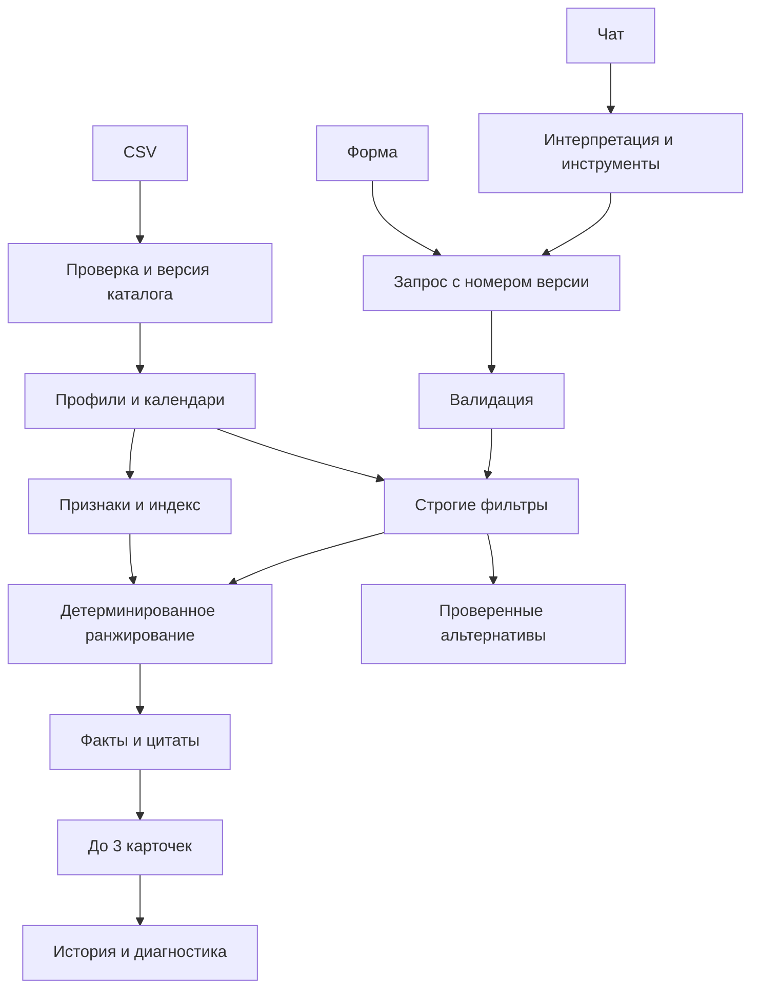

# Событие — подбор event-подрядчиков

Платформа команды **AI House**: форма и помощник используют единый сервис рекомендаций. На запрос возвращаются до трёх подрядчиков с конкретными объяснениями, проверенной занятостью и ссылкой на факты профиля.

Реализовано на основе документов в `project-df`: исходное ТЗ, «Архитектура платформы подбора подрядчиков.docx» и `Use-cases.xlsx`. В Excel заполнены UC-01–UC-13; UC-14–UC-20 пустые. Дополнительные сценарии реализованы по документу архитектуры.

## Быстрый запуск на Windows

Требуются Python 3.12+ и Node.js 20.19+ (или 22+).

Из корня репозитория:

```powershell
.\start.cmd
```

Откройте **http://127.0.0.1:8000**. API-документация: **http://127.0.0.1:8000/docs**. Остановка — `Ctrl+C` в терминале.

Скрипт создаст окружение, если его нет, установит недостающие зависимости и соберёт интерфейс при первом запуске. Повторный запуск готовой сборки не требует сети. Для пересборки после изменений frontend:

```powershell
.\start.cmd --rebuild
```

Также доступен `./start.ps1` с параметрами `-Rebuild` и `-Setup`. В этой Windows выполнение `.ps1` запрещено системной политикой, поэтому основной запуск сделан через `start.cmd`: менять политику PowerShell не требуется.

Локально используется SQLite (`data/platform.db`). Регистрация и API-ключ не нужны для формы, фильтров, сравнения, альтернатив и ограниченного локального помощника. Папка `data/` создаётся автоматически и не включена в Git.

## Ручной запуск и разработка

```powershell
python -m venv .venv
.\.venv\Scripts\python.exe -m pip install -r backend/requirements-dev.txt
cd frontend
npm ci
npm run build
cd ..
.\.venv\Scripts\python.exe -m uvicorn backend.main:app --host 127.0.0.1 --port 8000
```

Для разработки запустите backend с `--reload`, а во втором терминале:

```powershell
cd frontend
npm run dev
```

Frontend доступен на `http://127.0.0.1:5173`; Vite проксирует `/api` на порт 8000. В Linux/macOS используйте `.venv/bin/python` вместо `.venv\Scripts\python.exe`.

Точные версии проверенного Python-окружения записаны в `backend/requirements-tested.txt`. Для их воспроизведения можно установить зависимости с дополнительным параметром `-c backend/requirements-tested.txt`. Frontend зафиксирован в `package-lock.json`.

## Docker + PostgreSQL

```powershell
docker compose up --build
```

Приложение: `http://127.0.0.1:8000`. PostgreSQL хранит данные в отдельном Docker volume; наружу порт базы не публикуется. Для остановки без удаления данных: `docker compose down`.

Docker Engine должен быть запущен. В среде разработки служба Docker была выключена, поэтому фактический запуск Compose/PostgreSQL здесь **не проверен**. Локальная версия с SQLite проверена автоматическими API- и браузерными тестами.

## Что уже работает

- Обязательные поля: город, дата, формат, категория, бюджет **на одного подрядчика**.
- Дополнительные поля: длительность, язык, свободные пожелания.
- Строгие ограничения: занятость, формат, стартовая цена, язык, часы.
- До трёх рекомендаций; отдельные исходы `MATCHED`, `CATEGORY_ABSENT`, `NO_MATCH`.
- Объяснения из конкретных полей и цитат; раскрываемые основания и полный профиль.
- Сравнение двух или трёх кандидатов.
- Реально рассчитанные альтернативы даты, бюджета, языка и длительности, применяемые только по нажатию.
- Изменение даты с объяснением изменения состава карточек.
- История последних 20 запусков текущего мероприятия; сохранение чата и запроса между перезагрузками в той же браузерной сессии.
- Единый запрос формы и чата, контроль версий, защита от устаревших изменений.
- Показанная подборка — контекст чата: полные сведения о кандидатах, их порядок, условия и причины выбора; вопросы про «второго» не изменяют фильтры.
- Отметки синтетических профилей, проставленных цен и городов.
- Адаптивный интерфейс, клавиатурная навигация, модальные окна с управлением фокусом.

Бронирование, оплата, заявки и сообщения подрядчикам не выполняются — это ограничение ТЗ.

## Помощник и режимы ИИ

Создайте локальный `.env` на основе `.env.example`, если хотите включить внешний ИИ. Не добавляйте ключи в репозиторий.

```dotenv
OPENAI_API_KEY=your-api-key
OPENAI_CHAT_MODEL=gpt-4.1-mini
OPENAI_BASE_URL=https://api.openai.com/v1
```

Перезапустите backend. Модель настраивается и должна поддерживать Chat Completions с function calling. В интеграции используются официальные схемы [вызова функций OpenAI](https://developers.openai.com/api/docs/guides/function-calling).

LLM выбирает один ограниченный инструмент за сообщение: изменить запрос, повторить подбор, открыть профиль, сравнить, рассчитать альтернативы, пояснить возможности или задать вопрос. Все изменения повторно проверяются Pydantic. Ответы о подрядчиках собираются backend из результата инструмента: модель не определяет итоговую тройку и не сочиняет цены или доступность.

Без ключа работает **локальный помощник**, явно помеченный в интерфейсе. Он разбирает распространённые русские формулировки регулярными выражениями и использует те же инструменты. Это ограниченный резервный режим, **не языковая модель**. При таймауте/ошибке внешнего API происходит явный переход в него.

Примеры:

```text
Нужен ведущий в Алматы на корпоратив 10 октября 2026, до миллиона,
на русском, на 6 часов. Хочется интеллигентного юмора.
А теперь на 17 октября
Сравни варианты
Расскажи про второго
Второй говорит на английском?
Кто из них дешевле?
Почему Куррапика не попал в подборку?
Покажи другие даты
```

После поиска через форму в чате появляется блок **«Вижу вашу подборку»** с теми же кандидатами в том же порядке. Их можно обсудить по имени или номеру; модель получает описания, цены, языки, длительность, причины выбора и исходные условия. Для вопросов по карточкам поиск повторно не запускается. Ответы формируются из сохранённого результата; цитаты, выбранные моделью, проверяются по исходному описанию.

Каждое сообщение передаёт `displayed_run_id`. Backend проверяет, что подборка принадлежит текущему запросу и сессии. Это исключает подмену контекста более новым запуском в другой вкладке. Если фильтры изменены, но новый поиск ещё не выполнен, чат явно обсуждает предыдущую подборку. После нового поиска контекст обновляется; при пустой выдаче старые кандидаты не используются.

Реальный вызов OpenAI не проверялся: API-ключ не предоставлен. Контракт вызова и отказоустойчивость проверяются с подменённым внешним ответом в тестах.

## Смысловое ранжирование

Три явно различимых режима, выбранных через `EMBEDDING_PROVIDER`:

| Значение | Что используется | Требования |
| --- | --- | --- |
| `local` (по умолчанию) | Фиксированный словарь смысловых признаков + совпадение текстовых основ | Работает без сети и моделей; ограниченное качество |
| `openai` | Предобученные embeddings через API; векторы профилей и запросов кешируются в БД | API-ключ, сеть, доступная embedding-модель |
| `sentence-transformers` | Локальная предобученная мультиязычная модель | Дополнительные зависимости и скачанные веса |

`local` не выдаётся за нейросетевые embeddings. Он позволяет воспроизвести все основные сценарии без внешних зависимостей. Для полноценного нейросетевого сопоставления включите один из двух других режимов.

OpenAI embeddings:

```dotenv
EMBEDDING_PROVIDER=openai
OPENAI_EMBEDDING_MODEL=text-embedding-3-small
```

```powershell
.\.venv\Scripts\python.exe -m backend.cli prepare
```

Для локальной модели рекомендуется отдельное окружение Python 3.12/3.13 с поддерживаемым PyTorch:

```powershell
.\.venv\Scripts\python.exe -m pip install -r backend/requirements-semantic.txt
```

```dotenv
EMBEDDING_PROVIDER=sentence-transformers
SENTENCE_MODEL=sentence-transformers/paraphrase-multilingual-MiniLM-L12-v2
```

Затем выполните `python -m backend.cli prepare` из нужного окружения. Первый запуск скачивает веса; далее можно использовать локальный кеш модели. Эти два режима реализованы, но реальные удалённые вызовы и скачивание весов в текущей среде не проверялись.

Embeddings профилей считаются при подготовке/старте и сохраняются. Новые запросы кодируются отдельно, их векторы кешируются. При отказе активного embedding-провайдера система сообщает техническую ошибку: она не меняет незаметно алгоритм и порядок выдачи.

## Пайплайн



Порядок ранжирования: число совпавших смысловых признаков → текстовое/векторное сходство → меньшая стартовая цена → ID. Без пожеланий используется цена → ID. Сходство не является оценкой качества услуг или вероятностью успеха.

Каждый запуск сохраняет нормализованные условия, версии каталога/правил/индекса, состав карточек и причины исключения. Одинаковый запрос в одной версии даёт одинаковый порядок. Обновление каталога или конфигурации может изменить результат.

Календари действуют только **23.09–31.12.2026**. `max_hours = null` у флористов, декораторов и сувениров означает неприменимость часов. «Работаю по всему миру» в описании не отменяет фильтр города. При конфликте описания и структурированных полей строгие ограничения определяются полями.

## Хранение и структура

```text
backend/
  main.py          HTTP API, сессии, версии запросов, раздача frontend
  schemas.py       Валидация формы и контрактов
  catalog.py       Проверка и импорт CSV
  engine.py        Фильтры, ранжирование, объяснения, альтернативы
  semantic.py      Признаки, evidence, три режима сопоставления
  assistant.py     Инструменты LLM и локальный разбор сообщений
  storage.py       SQLAlchemy: каталог, запросы, запуски, чат, векторы
  cli.py           Проверка данных, индексация, диагностика
  tests/           Интеграционные и предметные тесты
frontend/
  src/             React + TypeScript, стили, API-клиент
  tests/           Playwright: реальные пользовательские сценарии
project-df/        Исходные документы и неизменённый датасет
docs/             Матрица требований
```

Для небольшой выборки профиль хранится как проверенный JSON в таблице `contractors`, включая календарь. Цитаты извлекаются детерминированно из исходного описания и сохраняются в снимке результата; отдельной таблицы редактируемых признаков нет. Это упрощение физической модели архитектуры, не изменение правил подбора. При старте CSV импортируется целиком одной транзакцией; повреждённый файл не публикуется частично.

SQLAlchemy поддерживает SQLite для локального запуска и PostgreSQL для Compose. Сессия использует случайный HttpOnly/SameSite-cookie. Доступ к запросу проверяется по владельцу; знания ID недостаточно. История относится к текущему мероприятию. При «Новом мероприятии» начинается новый запрос; общего кабинета со списком всех мероприятий пока нет.

## API

| Метод | Путь | Назначение |
| --- | --- | --- |
| GET | `/api/health` | Проверка готовности |
| GET | `/api/catalog/options` | Справочники, количество профилей, режимы |
| POST | `/api/selection-requests` | Создать черновик |
| GET / PATCH | `/api/selection-requests/{id}` | Получить / обновить запрос |
| POST | `/api/selection-requests/{id}/recommendations` | Выполнить подбор |
| POST | `/api/selection-requests/{id}/alternatives` | Рассчитать альтернативы |
| POST | `/api/selection-requests/{id}/compare` | Сравнить текущие карточки |
| GET | `/api/contractors/{id}` | Полный профиль |
| POST | `/api/chat/messages` | Сообщение помощнику |

Изменения и подбор принимают `expected_revision`. Устаревшая версия даёт `409`; неполный/некорректный запрос — `422`; отсутствие чужого или неизвестного запроса — `404`. Сбой embedding-провайдера — `503`, а не `NO_MATCH`.

## Проверки

```powershell
.\.venv\Scripts\python.exe -m pytest -q
.\.venv\Scripts\python.exe -m backend.cli validate
.\.venv\Scripts\python.exe -m backend.cli benchmark
cd frontend
npm run build
npm run test:e2e
```

Playwright использует установленный Google Chrome без окна и автоматически запускает отдельный backend на порту **8765**, с базой `data/e2e.db`, без API-ключа и с локальным сопоставлением. Пользовательский сервер на порту 8000 тесты не затрагивают. Перед браузерными тестами обязательно соберите frontend. Скриншоты сохраняются в `data/screenshots/`, ошибки и трассы — в `frontend/test-results/`.

Порт 8765 должен быть свободен. Тестовые настройки передаются только процессу тестового сервера; файл `.env` не изменяется.

Проверяются календарь на всех 100 датах, язык, часы, площадки, редкие категории, оба вида пустого результата, проверяемость альтернатив, повторы, версии, изоляция сессий, работа при отказе LLM, профиль, сравнение, история и мобильный экран. Соответствие Excel: [docs/use-cases.md](docs/use-cases.md).

## Демонстрация для жюри

Язык и длительность в следующих запросах оставлены пустыми.

| Город / категория / формат | Дата | Бюджет | Ожидаемый результат до выбора тройки |
| --- | --- | --- | --- |
| Алматы / ведущий / корпоратив | 10.10.2026 | 1 000 000 ₸ | 4 подходящих, показаны 3 |
| Те же условия | 17.10.2026 | 1 000 000 ₸ | 3 подходящих, другой состав |
| Алматы / флорист / свадьба | 10.10.2026 | 500 000 ₸ | Только Тони Тони Чоппер |
| Те же условия | 17.10.2026 | 500 000 ₸ | Только Тихиро Огино |
| Алматы / ведущий / корпоратив | 10.10.2026 | 10 000 ₸ | `NO_MATCH` |
| Астана / декоратор / свадьба | 10.10.2026 | 3 000 000 ₸ | `CATEGORY_ABSENT` |

На локальной машине контрольный прогон движка дал медиану около 0,4 мс и максимум около 3 мс для пяти базовых запросов. Это время только движка: сеть, LLM, запуск модели и отрисовка в него не входят. Общий ориентир ТЗ — до 10 секунд; задержку внешнего API следует измерять после подключения ключа.

## Обслуживание каталога

```powershell
.\.venv\Scripts\python.exe -m backend.cli validate --dataset "project-df/hackathon dataset anonymized .csv"
.\.venv\Scripts\python.exe -m backend.cli features
.\.venv\Scripts\python.exe -m backend.cli prepare
.\.venv\Scripts\python.exe -m backend.cli inspect-run --run-id ID_ИЗ_ОТВЕТА
```

После изменения CSV проверьте его и перезапустите backend. Можно задать другой путь через `DATASET_PATH`. Добавленные демонстрационные профили должны иметь `synthetic=True`. Исходные 66 профилей не изменены.

Приложение предназначено для локального демо. Перед публичным развёртыванием нужны HTTPS (`COOKIE_SECURE=true`), ограничения частоты запросов и расходов на API, авторизация администрирования, стратегия миграций и резервного копирования. В текущей конфигурации следует использовать один backend worker; версионирование запросов также защищается SQL-проверкой ревизии.

Команда: **AI House**. Репозиторий: `hack-423e0010-ai-house`. Исходный README: Nurlan.

