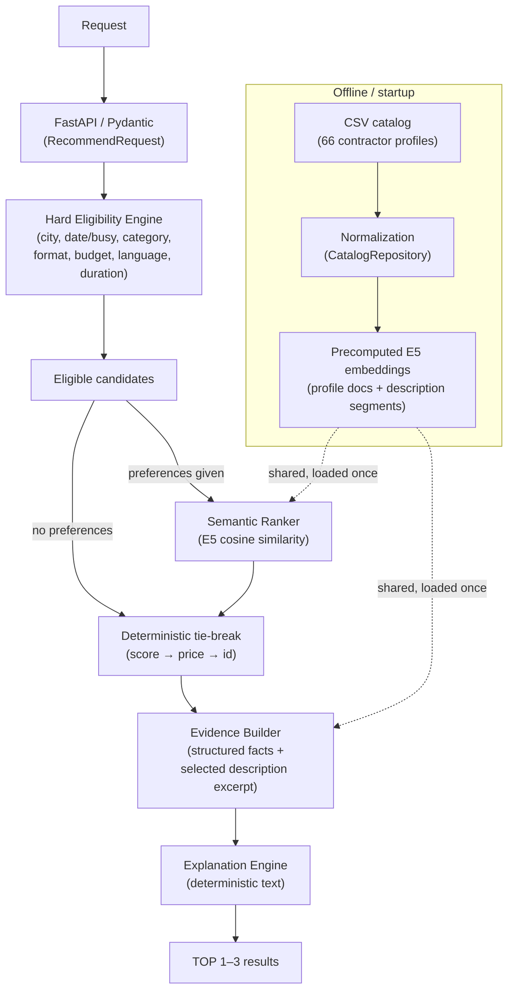

# Explainable Contractor Recommendation Engine

A deterministic, explainable backend that recommends event contractors from an existing catalog — no LLM ever picks the final result.

## Problem

The customer already has a catalog of event contractors across cities and categories (florists, hosts, photographers, decorators, bands, venues, ...). They don't need a bigger catalog — they need help **choosing among the contractors that already exist** for a specific event: right city, right date, right format, right budget, right language, right duration.

Generic sorting (price, rating, alphabetical) doesn't answer "why this one?" The core value this backend delivers is **explanation quality**: every recommendation comes with a machine-checkable reason grounded in the contractor's real data, not a black-box score.

## Solution

A hybrid pipeline, in this order:

```
structured hard constraints
  → eligible candidate pool
  → semantic preference ranking (only if free-text preferences were given)
  → deterministic tie-breaking
  → evidence extraction
  → explainable TOP-3
```

**Key design principle:**

> Hard constraints decide *who can be recommended*. AI helps decide *who among eligible candidates best matches the user's preferences*.

AI never determines eligibility. A contractor who is busy, over budget, in the wrong city, or missing the requested format/language/duration is excluded before any embedding model runs — and no similarity score can override that.

## Key capabilities

All of the following are implemented and covered by tests:

- Hard filtering on city, event date (with busy-date exclusion), category, event format, and budget
- Optional language and duration filtering (duration check is skipped, not failed, when a contractor's `max_hours` doesn't apply to that category)
- Free-text `preferences` for semantic ranking of the already-eligible pool
- Deterministic ordering with explicit tie-break rules (never randomness, never an LLM)
- At most 3 recommendations per request
- Grounded, contractor-specific explanations (structured facts + a verbatim excerpt from the contractor's own description)
- Explicit empty-result states (`CATEGORY_ABSENT` vs. `NO_MATCH`) instead of a silent empty list
- Machine-readable rejection reasons per excluded candidate, plus an aggregated `rejection_summary`
- `synthetic`, `city_imputed`, and `price_imputed` metadata preserved and surfaced through the API

## Architecture



No PostgreSQL, chat agent, frontend, or vector database exists in this codebase — this diagram matches the actual implementation, not a future roadmap.

## Why this architecture

- **Structured fields are the source of truth.** Everything in `docs/hackathon dataset anonymized .csv`'s structured columns is authoritative over the free-text `description`.
- **Descriptions cannot override eligibility.** A contractor can write anything in their profile text; it is never consulted by the hard-filter stage.
- **Semantic similarity only ranks eligible contractors.** It reorders a pool that hard filtering already produced — it can never add or remove a candidate.
- **No LLM in final selection, ever.** The recommendation engine (`backend/app/services/recommendation.py`) is the single source of truth for both the structured form and any future chat layer.
- **No vector database.** The catalog has 66 profiles. An in-memory NumPy-scale similarity computation is faster and simpler than standing up a vector DB for a dataset this size.
- **Embeddings are precomputed once**, at process startup (FastAPI `lifespan`), not per request. Only the request's `preferences` text is encoded per call.
- **Deterministic price/id fallback.** Ties (in semantic score, or absence of preferences entirely) always resolve the same way: price ascending, then contractor id ascending.
- **Explanations are grounded in profile evidence** — every sentence traces back to a verified structured fact or a verbatim excerpt from the contractor's own description.

## AI / ML

- **Model:** [`intfloat/multilingual-e5-base`](https://huggingface.co/intfloat/multilingual-e5-base), loaded via `sentence-transformers`.
- **E5 convention:** the request's `preferences` text is encoded with the `"query: "` prefix; contractor documents/description segments are encoded with the `"passage: "` prefix — this is the retrieval convention the E5 model family was trained on.
- **Similarity:** cosine similarity between L2-normalized embeddings (a plain dot product), computed in-memory over the eligible pool only.
- **Evidence extraction:** each contractor's `description` is deterministically segmented (sentence/newline splitting); the segment with the highest cosine similarity to the query is selected as the grounding excerpt for that contractor's explanation — reusing the same query embedding already computed for ranking, so evidence extraction adds no extra model call.
- **`semantic_score` is a similarity value, not a probability, quality score, or percentage.** It is only meaningful for ordering within a single request's eligible pool.

Embeddings are a good fit here because `preferences` is unstructured free text in Russian/mixed language, and the catalog is far too small (66 rows) to fine-tune anything on — a pretrained multilingual sentence embedding model handles this out of the box with zero training.

## Determinism

**When `preferences` is present:**
1. semantic similarity score, descending (rounded to 6 decimal places for the tie-break comparison — scores within `1e-6` are treated as equal)
2. `price_from_kzt`, ascending
3. contractor `id`, ascending (final stable tie-break)

**When `preferences` is absent, empty, or whitespace-only:**
1. `price_from_kzt`, ascending
2. contractor `id`, ascending

No randomness anywhere in the pipeline. Contractor profile embeddings and description-segment embeddings are computed exactly once, at startup — the same request against the same running process always returns the same ids, order, scores, and explanation text.

## API

### `GET /health`
Liveness check. Returns `{"status": "ok"}`.

### `POST /api/v1/recommend`

Request body (`RecommendRequest`):

| field | type | required |
|---|---|---|
| `city` | string | yes |
| `event_date` | date (`YYYY-MM-DD`) | yes |
| `event_format` | string | yes |
| `category` | string | yes |
| `budget_kzt` | int (> 0) | yes |
| `duration_hours` | int (> 0) | no |
| `language` | string | no |
| `preferences` | string | no — drives semantic ranking when non-empty |

Example request (verified against the running app):

```bash
curl -X POST http://127.0.0.1:8000/api/v1/recommend \
  -H "Content-Type: application/json" \
  -d '{
    "city": "Алматы",
    "event_date": "2026-10-10",
    "event_format": "корпоратив",
    "category": "Ведущий",
    "budget_kzt": 1000000,
    "duration_hours": 6,
    "language": "русский",
    "preferences": "спокойная деловая интеллигентная подача, корпоративный стиль"
  }'
```

Shortened representative response:

```json
{
  "status": "MATCHED",
  "results": [
    {
      "id": "HK-88430",
      "name": "Куррапика",
      "categories": ["Ведущий"],
      "city": "Алматы",
      "price_from_kzt": 500000,
      "event_formats": ["конференция", "корпоратив", "юбилей"],
      "languages": ["русский"],
      "max_hours": 6,
      "synthetic": false,
      "city_imputed": false,
      "price_imputed": false,
      "semantic_score": 0.8108800649642944,
      "explanation": "Свободен 10 октября, формат «корпоратив», язык русский; рассчитан до 6 ч при запросе 6 ч; стартовая цена 500 000 ₸ укладывается в бюджет 1 000 000 ₸. В описании подрядчик делает акцент на: «Мой стиль — это сочетание интеллигентного юмора, четкой организации и высокого уровня ответственности.».",
      "evidence": {
        "available_on_date": true,
        "matched_event_format": "корпоратив",
        "matched_language": "русский",
        "requested_duration_hours": 6,
        "max_hours": 6,
        "price_from_kzt": 500000,
        "budget_kzt": 1000000,
        "semantic_excerpt": "Мой стиль — это сочетание интеллигентного юмора, четкой организации и высокого уровня ответственности.",
        "semantic_score": 0.8108800649642944
      }
    }
  ],
  "rejected": [
    { "contractor_id": "HK-44733", "reasons": ["BUSY"] }
  ],
  "rejection_summary": { "BUSY": 1 }
}
```

`rejected` and `rejection_summary` only cover in-scope candidates (right city/category) that failed a hard filter — they're empty when `status` is `CATEGORY_ABSENT`, since there's nothing in-scope to reject.

## Result states

- **`MATCHED`** — 1 to 3 eligible contractors found and returned.
- **`CATEGORY_ABSENT`** — no contractor in the requested city offers the requested category *at all*. There is nothing to filter — the category simply doesn't exist there.
- **`NO_MATCH`** — the city/category combination does exist, but every contractor in it failed at least one hard filter (busy, over budget, wrong format, etc.). `rejected` explains exactly why each one was excluded.

The distinction matters: `CATEGORY_ABSENT` means "expand the catalog for this city," while `NO_MATCH` means "the right contractors exist, but not for this specific date/budget/format."

An `event_date` outside the dataset's known calendar coverage window is rejected explicitly as an HTTP `422` — not silently treated as available.

### `POST /api/v1/chat` — AI assistant (optional)

A stateless conversational layer over the exact same recommendation engine as
`/api/v1/recommend`. **The LLM interprets conversation but never selects or ranks
contractors** — it only extracts a structured intent (`action` + a `patch` of search
fields); the backend validates and applies that patch, then calls
`app.services.recommendation.recommend` — the same function, same rules, same output —
to get the actual results. The LLM never sees contractor data and never writes the
`explanation` text.

Request:

```json
{
  "message": "А теперь 17 октября",
  "current_search": {
    "city": "Алматы", "event_date": "2026-10-10", "event_format": "корпоратив",
    "category": "Ведущий", "budget_kzt": 700000, "preferences": "спокойная интеллигентная подача"
  }
}
```

`current_search` is optional and sent back by the client on every turn — the server keeps
no session/chat history (no database, no Redis).

Response (`ChatResponse`): `action` (`SEARCH` / `UPDATE_SEARCH` / `CLARIFY` / `ANSWER`),
`assistant_message` (short Russian reply), `search` (the full updated state — the client
re-syncs its form from this), `missing_fields`, and `recommendation` (the same
`RecommendResponse` shape as `/api/v1/recommend`, or `null` while required fields are
still missing or the turn was purely conversational).

If a required field (city/event_date/event_format/category/budget_kzt) is still missing
after applying the patch, the response is `CLARIFY` with a concise Russian question — the
backend never guesses a missing mandatory value.

`GET /api/v1/catalog-options` returns the real dataset's cities/categories/event
formats/languages/calendar window, used both by the web form and injected into the LLM's
prompt so it only ever proposes values that actually exist in the catalog.

**Configuration** (`backend/.env`, see `backend/.env.example`) — any OpenAI-compatible
Chat Completions API:

| variable | required | notes |
|---|---|---|
| `LLM_API_KEY` | for chat only | unset → `/api/v1/chat` still responds, with `"AI-помощник не настроен. Обычный поиск продолжает работать."` |
| `LLM_MODEL` | no | default `gpt-4o-mini` |
| `LLM_BASE_URL` | no | only for a non-default/gateway endpoint |

**Core recommendation (`/api/v1/recommend`, and the web UI's manual search) works fully
without any LLM credentials. The AI assistant panel additionally requires
`LLM_API_KEY` configured.**

### Minimal web UI

A dependency-free HTML/CSS/vanilla-JS demo page is served directly by the backend at
**`http://127.0.0.1:8000/`** — no separate frontend process, no build step, just
`uvicorn app.main:app --reload`. It has the structured search form (options populated
from `GET /api/v1/catalog-options`), up to 3 result cards per search (with the
deterministic explanation front and center, semantic relevance score, and
synthetic/imputed badges), visibly distinct `MATCHED` / `CATEGORY_ABSENT` / `NO_MATCH`
states, and a chat panel wired to `/api/v1/chat` that syncs the form and result cards from
the assistant's replies.

## Quick Start

Requires **Python 3.11+**.

```bash
cd backend
python3.11 -m venv .venv
source .venv/bin/activate
pip install -e ".[dev]"
uvicorn app.main:app --reload
```

Then verify:

```bash
curl http://127.0.0.1:8000/health
# {"status":"ok"}
```

Open Swagger UI at **http://127.0.0.1:8000/docs**, or the demo web UI at **http://127.0.0.1:8000/**.

> **First startup is slower.** The `intfloat/multilingual-e5-base` embedding model (~278M params) is downloaded from the Hugging Face Hub and cached locally (`~/.cache/huggingface`) on first load — this can take a while depending on network speed. Startup also precomputes embeddings for the whole catalog once. Subsequent starts use the local cache and take a few seconds; warm requests after startup are consistently fast (see [Performance](#performance)).

No API key or external service is required for the recommendation engine or the web UI's
manual search — the embedding model runs locally once downloaded, and the catalog is
loaded from the CSV in this repository. The AI chat assistant is the one exception — see
[`POST /api/v1/chat`](#post-apiv1chat--ai-assistant-optional).

## Demo scenarios

Run these against a running server (`uvicorn app.main:app --reload`, default port `8000`; examples below use `8000` — adjust if you started on a different port).

### Demo 1 — dense category, no preferences

```bash
curl -X POST http://127.0.0.1:8000/api/v1/recommend -H "Content-Type: application/json" -d '{
  "city": "Алматы", "event_date": "2026-10-10", "event_format": "корпоратив",
  "category": "Ведущий", "budget_kzt": 1000000, "duration_hours": 6, "language": "русский"
}'
```

Verified result: `MATCHED`, price-ranked TOP-3 = `HK-88430` (500,000₸) → `HK-29829` (700,000₸) → `HK-27222` (1,000,000₸), with 6 in-scope candidates rejected (`BUSY` ×4, `OVER_BUDGET` ×2, one also `FORMAT_UNSUPPORTED`).

### Demo 2 — semantic preference change (same hard filters)

Same city/date/format/category/budget as above (budget lowered to 700,000₸ so the eligible pool is exactly `{HK-88430, HK-29829}`), two different `preferences`:

```bash
# Preference A — calm/business
curl -X POST http://127.0.0.1:8000/api/v1/recommend -H "Content-Type: application/json" -d '{
  "city": "Алматы", "event_date": "2026-10-10", "event_format": "корпоратив",
  "category": "Ведущий", "budget_kzt": 700000,
  "preferences": "спокойная деловая интеллигентная подача, корпоративный стиль"
}'

# Preference B — energetic/show
curl -X POST http://127.0.0.1:8000/api/v1/recommend -H "Content-Type: application/json" -d '{
  "city": "Алматы", "event_date": "2026-10-10", "event_format": "корпоратив",
  "category": "Ведущий", "budget_kzt": 700000,
  "preferences": "яркое шоу с танцами и развлечениями"
}'
```

Verified result: preference A ranks `HK-88430` first (0.8109 vs 0.8029); preference B flips the order, ranking `HK-29829` first (0.8172 vs 0.7739). **The eligible pool is identical in both calls — only the order changes.** This is the pipeline's core contract: semantic ranking never adds or removes candidates.

### Demo 3 — different date changes availability

Same request as Demo 1, date changed to `2026-09-23`:

```bash
curl -X POST http://127.0.0.1:8000/api/v1/recommend -H "Content-Type: application/json" -d '{
  "city": "Алматы", "event_date": "2026-09-23", "event_format": "корпоратив",
  "category": "Ведущий", "budget_kzt": 1000000, "duration_hours": 6, "language": "русский"
}'
```

Verified result: `HK-88430` (the previous #1) is now busy on this date and drops out of the results entirely, replaced by `HK-44923`.

### Demo 4 — rare category

```bash
curl -X POST http://127.0.0.1:8000/api/v1/recommend -H "Content-Type: application/json" -d '{
  "city": "Алматы", "event_date": "2026-10-10", "event_format": "свадьба",
  "category": "Ведущий церемонии", "budget_kzt": 300000
}'
```

Verified result: `MATCHED` with a single result (`HK-77793`) — "Ведущий церемонии" (ceremony host) is a niche category with only 3 profiles in the whole dataset (2 in Алматы).

### Demo 5 — no match

```bash
curl -X POST http://127.0.0.1:8000/api/v1/recommend -H "Content-Type: application/json" -d '{
  "city": "Астана", "event_date": "2026-10-10", "event_format": "той",
  "category": "Флорист", "budget_kzt": 300000
}'
```

Verified result: `NO_MATCH` — Астана has exactly one florist (`HK-90002`), but it doesn't support the `той` event format. `rejection_summary` = `{"FORMAT_UNSUPPORTED": 1}`.

### Demo 6 — category absent

```bash
curl -X POST http://127.0.0.1:8000/api/v1/recommend -H "Content-Type: application/json" -d '{
  "city": "Астана", "event_date": "2026-10-10", "event_format": "корпоратив",
  "category": "Декоратор", "budget_kzt": 500000
}'
```

Verified result: `CATEGORY_ABSENT` — every "Декоратор" (decorator) profile in the dataset is based in Алматы; none exist in Астана.

## Tests

```bash
cd backend
source .venv/bin/activate
pytest
```

**Verified: 73/73 passing.**

Main test groups (`backend/tests/`):
- `test_recommendation_service.py` — hard constraints (city/category/date/format/budget/language/duration), busy-date exclusion, `max_hours = null` handling, determinism, `MATCHED`/`CATEGORY_ABSENT`/`NO_MATCH` distinction
- `test_semantic_ranking.py` — semantic ranking trigger conditions, eligible-only scoring, determinism, busy/over-budget contractors never returned despite strong semantic match
- `test_explanation.py` — evidence grounding rules, description segmentation, explanation determinism, cross-contractor differentiation
- `test_api.py` — HTTP-level behavior, response schema, rejection summary, invalid-date `422`
- `test_semantic_evaluation.py` — the curated semantic evaluation cases below, run as pytest assertions

Semantic evaluation (standalone, prints every case's actual top-3 ids/scores/evidence):

```bash
python -m evaluation.run
```

**Verified: 12/12 cases, 0 strict failures, 0 soft failures.**

## Performance

Measured locally (Apple Silicon, model already cached):

- **One-time model init + catalog embedding (at process startup, via FastAPI `lifespan`):** ~15 seconds — this happens once per process, before the app starts accepting traffic, not on the first request.
- **Warm request latency:** ~14–36 ms per `POST /api/v1/recommend` call over real HTTP (median ~21.5 ms, 30-call sample, semantic ranking + evidence + explanation all included); the pure `recommend()` call itself (excluding HTTP/serialization overhead) runs in ~13–16 ms.

The one-time startup cost is never repeated per request — only the single `preferences` query string is encoded per call; the catalog's 66 profile embeddings are precomputed once.

## Dataset

- `docs/hackathon dataset anonymized .csv` — 66 contractor profiles across Алматы, Астана, and one in Зарубежье ("abroad").
- Some profiles are marked `synthetic: true` (synthetically generated, not real businesses) — this flag is preserved and returned on every result.
- `city_imputed` / `price_imputed` flag fields that were inferred during dataset preparation rather than given directly — also preserved and returned.
- Availability (`busy_dates`) is only known within the dataset's calendar coverage window (**2026-09-23 to 2026-12-31**); requests outside that window are rejected explicitly rather than silently assumed available.
- Structured fields (`city`, `categories`, `event_formats`, `languages`, `max_hours`, `busy_dates`, `price_from_kzt`) are authoritative over the free-text `description` for all filtering decisions.
- `price_from_kzt` is a **starting** price, never presented as final or guaranteed — explanation text always phrases it as such.

## Project structure

```
backend/
  app/
    api/            # FastAPI routes + dependency wiring (deps.py)
    domain/         # Contractor model, enums, evidence types (framework-independent)
    repositories/    # CSV loading/normalization, in-memory catalog
    schemas/         # Pydantic v2 request/response models
    services/
      recommendation.py    # the single recommendation engine (hard filter + rank)
      semantic.py          # E5 encoder, semantic ranking
      evidence.py          # description segmentation, evidence selection
      explanation.py       # deterministic explanation text generation
      response_builder.py  # RecommendResult -> API response, shared by /recommend and /chat
      chat.py               # chat orchestration: applies LLM patch, calls recommend()
      llm_client.py          # thin OpenAI-compatible Chat Completions wrapper
    static/             # dependency-free HTML/CSS/JS demo UI, served at "/"
    config.py
    main.py           # FastAPI app + startup warm-up (lifespan) + static mount
  evaluation/         # curated semantic-ranking evaluation cases + runner
  tests/
  pyproject.toml
docs/
  spec.md             # normalized backend requirements (source of truth)
  hackathon dataset anonymized .csv
TASKS.md
PROGRESS.md
```

## Design decisions / trade-offs

- **No vector database.** 66 profiles fit comfortably in memory as a small matrix; an ANN index would add operational complexity with zero benefit at this scale.
- **No LLM in ranking or selection.** Ranking is pure cosine similarity over a pretrained embedding model — reproducible, auditable, and impossible to hallucinate a nonexistent contractor.
- **No fine-tuning.** 66 records is far too small a dataset to fine-tune anything on; a pretrained multilingual sentence embedding model generalizes better out of the box.
- **Deterministic explanations, not generative ones.** Every explanation sentence is template-composed from verified structured facts and a verbatim description excerpt — never generated by a language model — so the same request always produces the same explanation, and nothing can be invented.
- **In-memory CSV catalog**, not a database. Matches the hackathon's Phase 1 scope and the 66-row dataset size; swapping in PostgreSQL later doesn't require changing the recommendation engine's interface.

These are deliberate choices for this problem's scale and phase, not missing engineering.

## Limitations

- Dense embedding similarity does not reliably handle negation — a documented evaluation case shows a "business style **without** entertainment" query still ranking an entertainment-style host first. This is a known general limitation of the underlying model, not something specific to this dataset (see `docs/spec.md` §10).
- `price_from_kzt` is a starting price; the actual final price may differ and isn't modeled here.
- Availability is only known inside the dataset's calendar coverage window (2026-09-23 to 2026-12-31); requests outside it are rejected rather than guessed.
- A fresh environment needs network access to Hugging Face Hub on first run to download and cache the embedding model; there's no vendored offline fallback.
- There is no booking/reservation workflow — this backend only recommends, it doesn't confirm or hold a slot.

## Future development

Not implemented in this phase — explicitly deferred:

- A conversational assistant calling the same recommendation engine (the engine is already framework-independent and usable headless for this)
- Stateful, multi-turn selection requests
- A production database (PostgreSQL) replacing the in-memory CSV catalog
- Larger-scale ANN/vector retrieval, only if/when catalog size actually requires it
- User feedback / relevance learning to improve ranking over time
